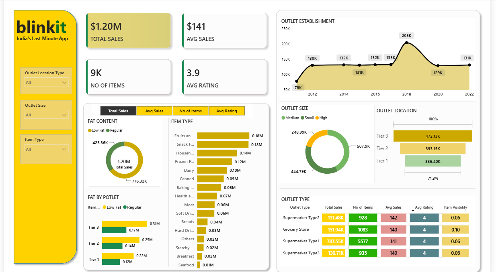
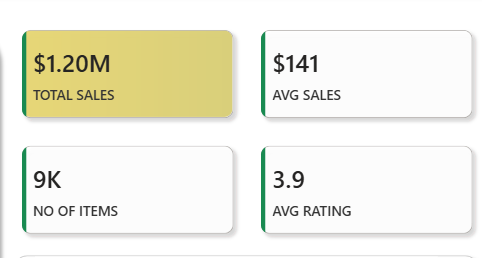
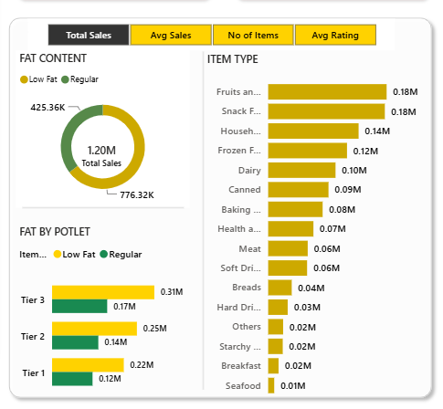
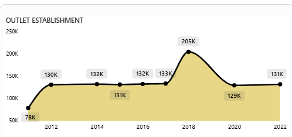

## 📊 Blinkit Grocery Sales Dashboard

### Built with Microsoft Power BI

## 🔗 Live Portfolio
👉 [View on Maven Showcase](https://mavenshowcase.com/project/57866)



---
This Power BI dashboard was built to provide end-to-end visibility into an Blinkit grocery performance across sales, outlet types, and customer ratings. The dashboard analyzes the total sales, no of Items and average ratings with interactive slicers for Outlet Location, Size and Item Type, enabling users to explore data dynamically without modifying the report.

---

## 🗂️ Dashboard Pages

### 1. Executive Overview.

 The comprehensive analysis of business performance, tracking key metrics like total sales, item counts, and customer ratings. It features dynamic filtering capabilities by outlet location, size, and item type, allowing stakeholders to perform granular deep-dives into operational data for improved decision-making.

 ---

 ### 2.Key Performance Indicators Metrics.
 
 
 Total Sales: Calculates the overall revenue from the dataset.
 Total Sales = SUM('blinket grocery data'[Item_Outlet_Sales])
 
 Average Sales: Calculates the average revenue generated per sale.
 Average Sales = AVERAGE('blinket grocery data'[Item_Outlet_Sales])
 
 Number of Items: Counts the total number of orders/rows in the dataset.
 Number of Items = COUNTROWS('blinket grocery data')

 Average Rating: Calculates the mean value of the customer ratings provided.
 Average Rating = AVERAGE('blinket grocery data'[Item_Rating])


 ---

 ### 3.Item Category & Fat Breakdown.
 
 
 Item Category (Item Type) Analysis:

The dashboard visualizes Total Sales by various Item Types using a Stacked Bar Chart 
Key Insights: Fruits and Vegetables rank as the highest-selling category, followed by Snack Foods and Household items
The analysis allows for further deep dives into metrics like Average Sales, Number of Items, and Average Ratings per category.

Fat Content Analysis:

Total Sales are categorized by Fat Content using a Donut Chart.
The dashboard also features a Clustered Bar Chart to show Fat Content by Outlet location, enabling users to see how different fat-content products perform across various outlet tiers 

---

### 4.Outlet Trends & Location Analysis.


Outlet Establishment Year: A line chart is used to visualize sales performance by establishment year.The stores established in 2018 show strong sales performance compared to older or newer locations.
Outlet Size: Using a donut chart, the analysis categorizes performance into Small, Medium, and High. The data shows that Medium-sized outlets currently generate the highest sales.
Outlet Location: A funnel chart is used to display sales across different city tiers (Tier 1, Tier 2, and Tier 3), illustrating how geographical location impacts total revenue.
Outlet Type: A matrix visual summarizes all performance metrics (Total Sales, Average Sales, Number of Items, and Average Ratings) categorized by Supermarket versus Grocery Store types.

---

### 5.Outlet Type Performance Matrix.
![Outlet Type Performance Matrix].(Page_5.png)

In the Blinkit Power BI project, a Matrix visual is used to conduct a comparative analysis between different Outlet Types (Supermarket vs. Grocery Store). This performance matrix aggregates several key metrics to provide a comprehensive business view:

Total Sales: Represents the cumulative revenue generated by each specific outlet type. This allows for an immediate understanding of which store format contributes the most to Blinkit's top-line growth
Average Sales: Indicates the mean revenue per transaction, helping analysts determine the spending patterns of customers at different store types.
Number of Items: Counts the volume of products sold, providing insight into operational demand and turnover rates across the different outlet categories.
Average Ratings: Tracks customer satisfaction, offering a qualitative measure of service quality and product availability for each store type.

Operational Context:

Supermarkets: Typically operate as dedicated, company-owned facilities where customers do not walk in but order exclusively through the Blinkit app.
Grocery Stores: These are often existing local shops that fulfill Blinkit orders while also serving walk-in customers, frequently observed in Tier 3 cities where dedicated infrastructure may be less dense.

## 🛠️ Tools & Techniques

| Tool | Usage |
|---|---|
| Power BI Desktop | Dashboard development |
| DAX | Custom measures and calculations |
| Power Query | Data cleaning and transformation |

## 📐 DAX Measures Created

```dax
Total Sales = SUM('blinket grocery data'[Item_Outlet_Sales])
Average Sales = AVERAGE('blinket grocery data'[Item_Outlet_Sales])
Number of Items = COUNTROWS('blinket grocery data')
Average Rating = AVERAGE('blinket grocery data'[Item_Rating])
```

---

## 📁 Dataset Fields

'Item Fat Content' . 'Item Identifier' . 'Item Type' . ' Item Weight' . ' Item Rating ' . 'Item Visibility' . 'Outlet Establishment Year' . 'Outlet Identifier' . 'Outlet Location Type' . 'Outlet Size' . 'Outlet Type' . 'Item Outlet Sales'

---

## 💡 Key Business Insights
- The company has generated $1.2M in total sales across its operations.
- The Average revenue per sale sits at approximately $141 per transaction
- The Average Rating is 3.9 needs to improve to 4.0+ for Customer satisfaction.
- **Top selling Category is Fruits & Vegetables by volume, followed by Snacks & Household
- **Tier 3 cities driving highest sales($472k)
- **Type1 Supermarkets($787k) outperform Grocery Stores ($152k)

  ---

  ## 📂 Files in This Repository

| File | Description |
|---|---|
| `POWER_BI_DASHBOARD.pbix` | Full Power BI project file |
| `Page_1.png` | Executive Overview |
| `Page_2.png` | KPI Metrics |
| `Page_3.png` | Item Category & Fat Breakdown |
| `Page_4.png` | Outlet Trends & Location Analysis |
| `Page_5.png` | Outlet Type Performance Matrix |

---

## 🙋 About
Built as a portfolio project to demonstrate Power BI skills including data modeling, DAX calculations, interactive slicers, and multi-page dashboard design.


 


